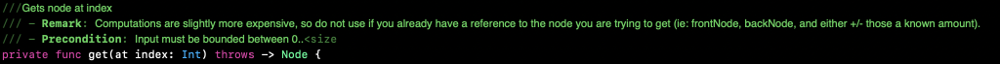
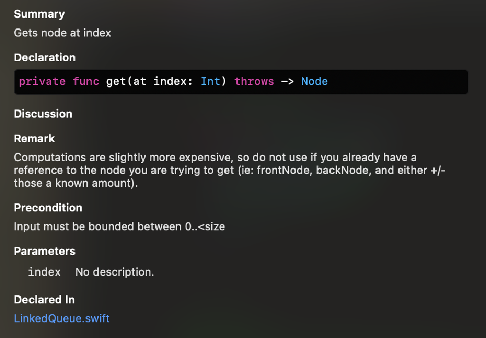

Xcode documentation is really fun! You can tag functions with comments, which are then presented nicely when you OPT+Click the function in context. Here is an example on a data structure. There are tons of tags you can use, see more at https://nshipster.com/swift-documentation/

## Other tips

> Pressing CMD+OPT+"/" will auto generate a skeleton.  
> — <cite>Josh Jaslow</cite>

*Originally published 09/12/2021 https://pittcsc.org/, republished 09/09/2022.*
